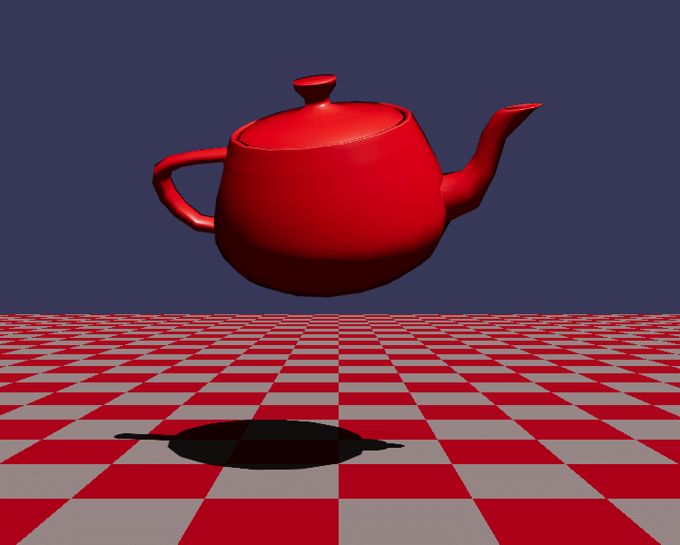

# 🫖 Teapot Amiga

A [POV-Ray](https://en.wikipedia.org/wiki/POV-Ray) inspired scene featuring a [Utah teapot](https://en.wikipedia.org/wiki/Utah_teapot) in an [Amiga](https://en.wikipedia.org/wiki/Amiga) [Sculpt 3D](https://en.wikipedia.org/wiki/Sculpt_3D)-inspired setting.

## Technologies

The core technologies used are _JavaScript_ and _WebGL_. The following libraries and tools are used:

| Name              | License | Description                                  |
| ----------------- | :-----: | -------------------------------------------- |
| React             |   MIT   | Component-based, front-end interface library |
| Three.js          |   MIT   | 3D graphics API for the web, based on WebGL  |
| React Three Fiber |   MIT   | A React renderer for Three.js                |
| Vite              |   MIT   | Frontend development tooling                 |

## Influencies

**POV-Ray**  
A powerful and highly customizable ray tracing software that allows users to create realistic 3D scenes by describing objects and their interactions with light using a scripting language.

**Utah Teapot**  
A classic 3D model often used in computer graphics research and demonstrations. It has become a standard reference object for testing and showcasing rendering techniques.

**Amiga**  
A reference to the iconic Amiga computers, known for their advanced graphics and multimedia capabilities in the 1980s and 1990s, and by the Sculpt 3D groundbreaking raytrace application.

## Assets

All the assets used (3D models, images etc.) were created by me.

## Software Used

A non-exhaustive list of all the software that was used during the development.

- Visual Studio Code
- Blender
- LibreSprite
- Google Chrome

## 💖 Support the Project

Thank you so much for your interest in my project! If you want to go a step further and support my open source work, buy me a coffee:

## License

Copyright (c) Michael Kolesidis  
Licensed under the [GNU Affero General Public License v3.0](https://www.gnu.org/licenses/agpl-3.0.html).
